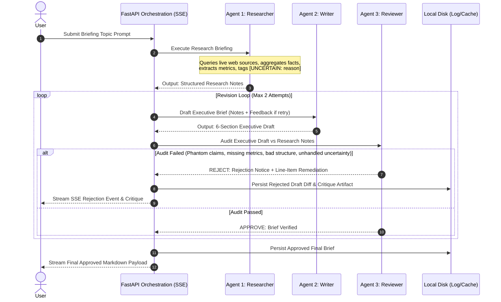

# PROJECT 4: THE RESEARCH CREW
## Collaborative Engineering Blueprint & Agentic Workflow Guide

> **Architecture:** Multi-Agent Crew | **Routing:** OpenRouter Free Models | **Persistence:** In-Memory / File Fallback | **Frontend:** React Client-Side Export

---

## 📑 TABLE OF CONTENTS
1. [System Architecture Overview](#1-system-architecture-overview)
2. [Agentic Model Execution & The Feedback Loop](#2-agentic-model-execution--the-feedback-loop)
3. [Team Role Division & Deliverables Blueprint](#3-team-role-division--deliverables-blueprint)
4. [Shared Team Contract: Schemas & Event Protocols](#4-shared-team-contract-schemas--event-protocols)
5. [7-Minute Demo Day Presentation Script](#5-7-minute-demo-day-presentation-script)

---

## 1. SYSTEM ARCHITECTURE OVERVIEW

**The Research Crew** is an autonomous multi-agent research and synthesis engine designed to turn any unconstrained briefing topic into a structured, verified briefing document. 

The architecture avoids vector database overhead by leveraging direct in-memory context handoffs between agents, strict deterministic audit loops, and client-side browser document generation.

> 🔑 **Core Operational Principle**  
> *A researcher and writer operating sequentially is simply a prolonged prompt. The reviewer agent holding explicit authority to evaluate drafts, detect unsourced metrics or phantom claims, and force iterative revision cycles is what creates an authentic agentic workflow.*

### 🛠️ System Component Layers

| Component Layer | Technology & Protocols | Core Purpose |
| :--- | :--- | :--- |
| **Client Layer** | React.js (Vite), Tailwind CSS (Monochrome), Lucide Icons | User interaction, real-time agent telemetry streaming, split-pane briefing viewer, and client-side Markdown file export. |
| **Orchestration Layer** | FastAPI, Server-Sent Events (SSE) / WebSockets | REST endpoint management, multi-agent lifecycle control, feedback loop iteration bounding, and event streaming. |
| **Intelligence Layer** | OpenRouter Gateway (Dynamic Free Model Routing) | Access to high-efficiency, zero-cost LLM endpoints (`Llama-3 8B`, `Mistral 7B`) with transparent fallback management. |
| **Storage Layer** | In-Memory Agent State + Local Disk Filesystem | Fast zero-database context transmission between agents; local logging of rejection artifacts and demo offline fallbacks. |

---

## 2. AGENTIC MODEL EXECUTION & THE FEEDBACK LOOP

The workflow executes across three distinct agents with strict responsibilities and bounded revision rounds.

### 🤖 The 3-Agent Collaborative Pipeline



#### Agent Responsibilities Breakdown

* **Agent 1: The Researcher**
  * **Input:** Unconstrained briefing topic prompt from user.
  * **Role:** Queries live web sources, aggregates facts, extracts quantitative metrics, and structures research notes.
  * **Constraint:** Must explicitly tag uncertain or ambiguous data points with `[UNCERTAIN: reason]` tags. Never resolves ambiguities by guessing.
* **Agent 2: The Writer**
  * **Input:** Structured research notes from Agent 1 (and targeted feedback from Agent 3 if handling a rejected draft).
  * **Role:** Drafts a comprehensive executive brief adhering strictly to the 6 mandatory section headings.
  * **Constraint:** Must address every line-item critique when revising a rejected draft.
* **Agent 3: The Reviewer ("The Teeth")**
  * **Input:** Draft brief from Agent 2 + Raw research notes from Agent 1.
  * **Role:** Acts as the strict quality gatekeeper. Directly cross-references every factual assertion in the draft against the research notes.
  * **Constraint:** If any audit check fails, issues a formal rejection notice with line-item remediation notes back to the writer.

---

### 🛡️ Deterministic Reviewer Validation Criteria ("The Teeth")

The Reviewer agent evaluates every draft against four explicit non-negotiable standards:

| Audit Dimension | Evaluation Standard | Action on Failure |
| :--- | :--- | :--- |
| **1. Claim Verification** | Does every factual claim map directly to documented research notes? | Reject draft; flag phantom claim for immediate removal. |
| **2. Metric Attribution** | Is every numerical statistic, currency, or percentage explicitly cited? | Reject draft; specify missing source requirement. |
| **3. Structural Compliance** | Are all six mandatory executive sections populated? | Reject draft; list missing structural headings. |
| **4. Uncertainty Handling** | Did the writer assert anything the researcher flagged as uncertain? | Reject draft; enforce conservative framing. |

> ⚙️ **Loop Boundary Rule**  
> Maximum **2 revision attempts** allowed. Once passed or maximum iterations are exhausted, the brief is finalized and written to local disk.

---

## 3. TEAM ROLE DIVISION & DELIVERABLES BLUEPRINT

To enable seamless team collaboration, development responsibilities are cleanly bifurcated between **Backend/Agentic Engineering** and **Frontend/Interface Engineering**.

```
                           +-----------------------------------+
                           |   PROJECT: THE RESEARCH CREW      |
                           +-----------------------------------+
                                             |
                   +-------------------------+-------------------------+
                   |                                                   |
        +-----------------------+                           +-----------------------+
        |   BACKEND ENGINEER    |                           |   FRONTEND ENGINEER   |
        +-----------------------+                           +-----------------------+
        | • FastAPI & Streaming |                           | • Monochrome React UI |
        | • OpenRouter Routing  |                           | • SSE Stream Consumer |
        | • Prompt Engineering  |                           | • Audit & Diff Viewer |
        | • Audit Engine Logic  |                           | • Client-Side Export  |
        | • Telemetry & Logging |                           | • Emergency Demo Mode |
        +-----------------------+                           +-----------------------+
```

### 🟨 BACKEND ENGINEER ROLE & DELIVERABLES

The Backend Engineer is responsible for orchestrating the multi-agent pipeline, model routing, audit mechanics, and streaming telemetry.

#### 1. API Gateway & Streaming Endpoint Management
* Implement FastAPI application structure.
* Create `/api/briefing/stream` endpoint returning `text/event-stream` (Server-Sent Events).
* Ensure non-blocking streaming execution using Python `asyncio` queues.

#### 2. OpenRouter Pipeline & Model Routing
* Configure API client connecting to OpenRouter Gateway.
* Implement free-tier model dynamic fallback (`meta-llama/llama-3-8b-instruct:free`, `mistralai/mistral-7b-instruct:free`).
* Implement token usage counter and rate-limit retry wrapper.

#### 3. Agent Prompt Engineering & Schema Templates
* Author explicit system prompts and operational rules for **Researcher**, **Writer**, and **Reviewer**.
* Enforce output formatting (JSON/Markdown schemas) for context handoffs between agents.
* Implement `[UNCERTAIN: reason]` enforcement prompt logic for the Researcher.

#### 4. Deterministic Audit Engine ("The Teeth")
* Code the Reviewer's 4 validation checks (Claim Verification, Metric Attribution, Structural Compliance, Uncertainty Handling).
* Build iterative feedback loop controller enforcing the **maximum 2 revision attempts** boundary rule.
* Pass structured rejection payloads (`line_item_critique`, `missing_sources`, `phantom_claims`) to the Writer on revision cycles.

#### 5. Telemetry & Fallback Logging
* Calculate execution metrics per step (elapsed time, estimated token count, cost tracking defaulting to `$0.00`).
* Write rejected draft diffs and critique artifacts to local disk (`/logs/rejections/`).
* Generate pre-rendered offline sample briefings (`/data/offline_briefing_sample.md`) for emergency demo fallbacks.

---

### 🟦 FRONTEND ENGINEER ROLE & DELIVERABLES

The Frontend Engineer is responsible for constructing a sleek, responsive, real-time user interface that visualizes agent telemetry and provides instant client-side document export.

#### 1. Minimalist Monochrome UI
* Build responsive layout using React.js (Vite) and Tailwind CSS in a high-contrast black-and-white theme.
* Design a split-pane layout: Left pane for Agent Telemetry & Rejection Feed; Right pane for Briefing Document Viewer.
* Integrate Lucide icons for agent status indicators (`Researcher`, `Writer`, `Reviewer`).

#### 2. Live Event Stream Consumer
* Implement custom EventSource hook connecting to FastAPI SSE streaming endpoints.
* Parse real-time SSE events to update active agent state, thought logs, current iteration count, and elapsed timer badges.

#### 3. Reviewer Audit & Diff Viewer
* Build an interactive audit log component highlighting Reviewer rejection events.
* Display line-item critique notes and visual diffs showing draft improvements across revision cycles.

#### 4. Client-Side Document Downloader
* Implement zero-backend browser Blob file export for approved briefing documents.
* Provide instant download buttons for Markdown (`.md`) and Plain Text (`.txt`).

#### 5. Emergency Offline Mode
* Build a prominent one-click UI trigger ("⚡ Load Demo Briefing") to load cached offline sample briefings instantly.
* Ensures presentation continuity even during model rate limits or network failures during live demos.

---

### 🤝 Integration Checkpoints & Handshake Protocol

```
+-----------------------------------------------------------------------------------+
| BACKEND DELIVERABLE                           FRONTEND CONSUMPTION POINT          |
+-----------------------------------------------------------------------------------+
| 1. GET/POST /api/briefing/stream          -->  EventSource / fetch-event-source   |
| 2. SSE Event: "agent_status"              -->  Telemetry Sidebar / Progress Feed  |
| 3. SSE Event: "reviewer_rejection"        -->  Audit Diff Viewer Component        |
| 4. SSE Event: "final_payload"             -->  Split-Pane Document Viewer         |
| 5. Static /offline_sample.json            -->  Emergency Offline Mode Toggle      |
+-----------------------------------------------------------------------------------+
```

---

## 4. SHARED TEAM CONTRACT: SCHEMAS & EVENT PROTOCOLS

The frontend and backend teams coordinate against fixed data structures without dependencies on external database schemas.

### 📜 Mandatory Executive Briefing Section Headings
All drafts and final documents **MUST** populate these 6 exact markdown headings:
1. `# Executive Summary`
2. `# Market Context`
3. `# Key Competitors & Metrics`
4. `# Risks & Regulations`
5. `# Strategic Recommendations`
6. `# Verified Source Ledger`

---

### 📡 SSE Status Event Format

Backend streams updates adhering to this JSON schema:

```json
{
  "event": "agent_telemetry",
  "data": {
    "agent": "Reviewer",
    "status": "in_progress",
    "status_message": "Cross-referencing draft metrics against research notes...",
    "iteration": 1,
    "max_iterations": 2,
    "telemetry": {
      "elapsed_seconds": 14.2,
      "estimated_tokens": 1850,
      "estimated_cost_usd": 0.00
    },
    "rejection_critique": null
  }
}
```

#### Rejection Event Data Payload Example:
```json
{
  "event": "reviewer_rejection",
  "data": {
    "agent": "Reviewer",
    "status": "rejected",
    "status_message": "Draft rejected on Iteration 1. Uncited metric detected.",
    "iteration": 1,
    "max_iterations": 2,
    "telemetry": {
      "elapsed_seconds": 18.7,
      "estimated_tokens": 2400,
      "estimated_cost_usd": 0.00
    },
    "rejection_critique": {
      "audit_dimension": "Metric Attribution",
      "failed_line": "Market growth is projected at 34% annually.",
      "remediation_note": "Specify primary source for 34% annual growth figure or reframe conservatively."
    }
  }
}
```

---

### 📦 Final Payload Format
When execution succeeds (or max iterations complete), the backend returns the complete approved Markdown document text:

```json
{
  "event": "final_delivery",
  "data": {
    "status": "completed",
    "iteration_count": 2,
    "total_elapsed_seconds": 42.8,
    "total_tokens": 5120,
    "total_cost_usd": 0.00,
    "markdown_content": "# Executive Summary\n\n..."
  }
}
```

---

## 5. 7-MINUTE DEMO DAY PRESENTATION SCRIPT

| Timestamp | Segment Focus | Presentation Script & Team Action |
| :--- | :--- | :--- |
| **0:00 – 0:45** | **The Core Problem** | **Presenter:** State clearly: *"A quality briefing takes an analyst most of a day. Rushing produces hallucinations and unsourced assertions."* |
| **0:45 – 1:45** | **System Architecture** | **Presenter:** Explain the 3-agent pipeline: Researcher gathers, Writer synthesizes, and Reviewer audits. Highlight the strict Backend/Frontend team division. |
| **1:45 – 3:00** | **The Rejection Moment** | **Presenter & UI Demo:** Key evaluation highlight: Walk through the logged artifact of the Reviewer rejecting an unsourced metric and forcing a re-draft. Highlight *"The Teeth"* deterministic engine. |
| **3:00 – 3:30** | **Live Run Trigger** | **Presenter:** Prompt the audience for an unexpected briefing topic. Submit the topic on the UI and show live SSE streaming activating. |
| **3:30 – 5:30** | **Buffer Walkthrough** | **Presenter & UI Demo:** Never watch a progress bar. Pull up the pre-rendered offline fallback brief on the UI to demonstrate formatting and source quality while the background job processes. |
| **5:30 – 6:15** | **Live Run Delivery** | **Presenter:** Return to the completed live run. Inspect the verified output and demonstrate instantaneous client-side file download (`.md`). |
| **6:15 – 7:00** | **Metrics & Defense** | **Presenter:** State total runtime, token count, cost (**$0.00** via free OpenRouter models), note search rate limits, and transition to Q&A. |
