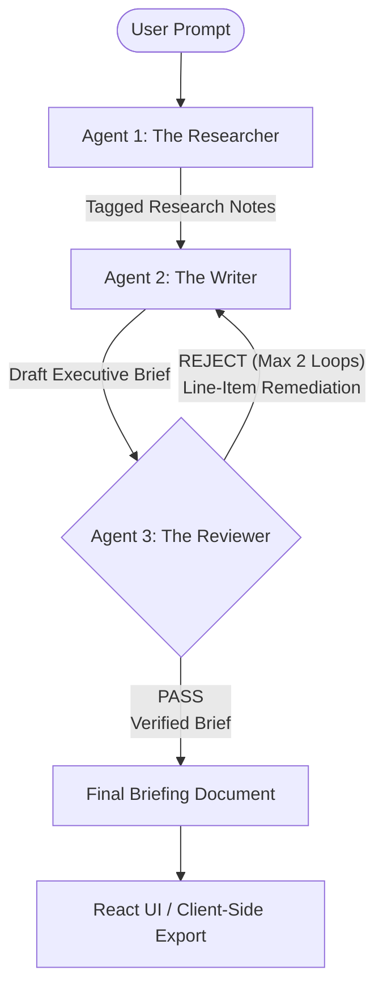

# Project 4: The Research Crew

> **Autonomous Multi-Agent Research & Synthesis Engine**  
> *A collaborative engineering architecture featuring deterministic audit loops, OpenRouter free model routing, real-time SSE streaming, and client-side Markdown file generation.*

---

## 📋 System Overview

**The Research Crew** is an autonomous multi-agent engine designed to transform any unconstrained briefing topic into a structured, verified, executive-ready briefing document. 

Rather than relying on single long-prompt generation or heavy vector database infrastructure, The Research Crew utilizes **direct in-memory context handoffs**, **deterministic reviewer audit loops**, and **client-side browser document compilation**.

### 💡 Core Operational Principle
> *A researcher and a writer operating sequentially is simply a prolonged prompt. A reviewer agent holding explicit authority to evaluate drafts, detect unsourced metrics or phantom claims, and force iterative revision cycles is what creates an authentic agentic workflow.*

---

## 🛠️ Architecture & Technology Stack

| Component Layer | Technology & Protocols | Core Purpose |
| :--- | :--- | :--- |
| **Client Layer** | React.js (Vite), Tailwind CSS (Monochrome), Lucide Icons | User interaction, real-time agent telemetry streaming, split-pane briefing viewer, and client-side Markdown/Text file export. |
| **Orchestration Layer** | FastAPI, Server-Sent Events (SSE) / WebSockets | REST endpoint management, multi-agent lifecycle control, feedback loop iteration bounding, and event streaming. |
| **Intelligence Layer** | OpenRouter Gateway (Dynamic Free Model Routing) | Access to high-efficiency, zero-cost LLM endpoints (Llama-3 8B, Mistral 7B) with transparent fallback management. |
| **Storage Layer** | In-Memory Agent State + Local Disk Filesystem | Fast zero-database context transmission between agents; local logging of rejection artifacts and demo offline fallbacks. |

---

## 🤖 The 3-Agent Collaborative Pipeline



1. **Agent 1: The Researcher**  
   Receives the briefing prompt, queries live web sources, aggregates facts, extracts quantitative metrics, and explicitly tags uncertain or ambiguous data points with `[UNCERTAIN: reason]` tags.
2. **Agent 2: The Writer**  
   Ingests structured research notes and drafts an executive brief adhering to rigid structural heading conventions. Incorporates line-item remediation notes when handling a rejected draft.
3. **Agent 3: The Reviewer ("The Teeth")**  
   Acts as the gatekeeper. Directly cross-references every factual assertion in the draft against the research notes. Performs deterministic validation across 4 dimensions (Claim Verification, Metric Attribution, Structural Compliance, Uncertainty Handling) and issues rejection notices when checks fail.

---

## 👥 Team Role Bifurcation

| Role | Key Deliverables & Responsibilities |
| :--- | :--- |
| **Backend / Agentic Engineer** | • FastAPI REST endpoints & SSE streaming<br>• OpenRouter API client with free model fallback & token tracking<br>• Agent prompt engineering (Researcher, Writer, Reviewer)<br>• Deterministic Reviewer audit engine & max 2 revision boundary<br>• Telemetry, latency/cost tracking & rejection diff disk logging |
| **Frontend / Interface Engineer** | • Sleek monochrome high-contrast split-pane React UI<br>• Real-time SSE stream consumer (agent state, thought logs, timers)<br>• Reviewer audit & rejection diff viewer<br>• Client-side Blob file downloader (`.md` / `.txt`)<br>• Emergency offline mode for demo presentation caching |

---

## 📂 Repository Structure

```
research-crew/
├── README.md                      # Primary project overview and quickstart guide
├── AGENTIC_WORKFLOW_GUIDE.md       # Detailed role division, agentic workflow & collaboration blueprint
├── backend/                       # FastAPI Server & Agentic Engine
│   ├── app/
│   │   ├── main.py                # FastAPI app entry point & SSE streaming endpoints
│   │   ├── agents/                # Prompt templates & agent implementations (Researcher, Writer, Reviewer)
│   │   ├── core/                  # OpenRouter API client, fallback router, telemetry engine
│   │   └── audit/                 # Deterministic validation rules & reviewer audit engine
│   └── requirements.txt           # Python dependencies
└── frontend/                      # React (Vite) User Interface
    ├── src/
    │   ├── components/            # Split-pane viewer, telemetry stream, diff viewer
    │   ├── hooks/                 # Custom SSE listener & state management hooks
    │   └── utils/                 # Client-side Markdown Blob downloader & offline fallback cache
    ├── package.json
    └── vite.config.js
```

---

## 🚀 Quick Start Guide

### Prerequisites
- Python 3.10+
- Node.js 18+ & npm
- OpenRouter API Key (free tier supported)

### 1. Backend Setup
```bash
cd backend
python -m venv venv
source venv/bin/activate  # On Windows: venv\Scripts\activate
pip install -r requirements.txt

# Set OpenRouter API Key
export OPENROUTER_API_KEY="your_openrouter_api_key_here"

# Start FastAPI server
uvicorn app.main:app --reload --port 8000
```

### 2. Frontend Setup
```bash
cd frontend
npm install
npm run dev
```
Open [http://localhost:5173](http://localhost:5173) in your browser.

---

## 📄 Shared Data & Event Contract

### 1. Mandatory Executive Section Headings (6 Required)
1. `Executive Summary`
2. `Market Context`
3. `Key Competitors & Metrics`
4. `Risks & Regulations`
5. `Strategic Recommendations`
6. `Verified Source Ledger`

### 2. SSE Telemetry Stream Event Format
```json
{
  "agent": "Reviewer",
  "status_message": "Evaluating draft against research notes...",
  "iteration": 1,
  "telemetry": {
    "elapsed_seconds": 12.4,
    "estimated_tokens": 1420
  },
  "rejection_critique": null
}
```

---

## 📖 Complete Documentation & Collaboration Guide

For deep-dive technical specs, prompt schemas, deterministic validation matrix ("The Teeth"), detailed role assignments, and the **7-Minute Demo Day Presentation Script**, refer to:
👉 **[AGENTIC_WORKFLOW_GUIDE.md](file:///home/joshuasco/projects/tech4youth/research-crew/AGENTIC_WORKFLOW_GUIDE.md)**
